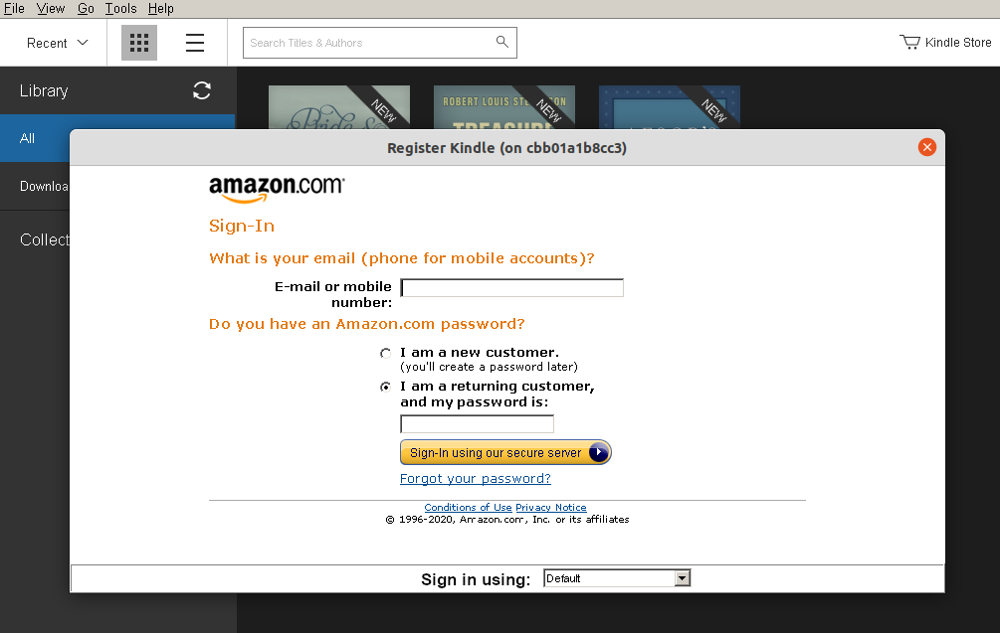
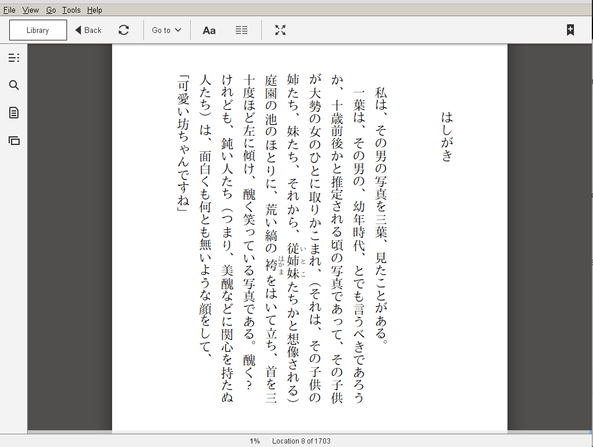

# Kindle on Linux, without messing up your environment!

NOTICE: 
- This image was developed for Japanese users.
- Currently, doesn't support for data persistence ([issue#2](https://github.com/igarash1/docker-wine-kindle/issues/2)) since just adding `wine` foloder to VOLUME didn't work for me. Welcome your contributions.

## Installation

1. Clone or download this repository.
    ```shell
    $ git clone https://github.com/igarash1/docker-wine-kindle.git
    ```
1. Next, build the image (This will take some minutes.)
    ```shell
    $ bash ./builder.sh
    ```
1. Run the docker image and get into the docker container.
    ```shell
    bash ./launcher.sh
    ```
1. Run the Kindle in the docker container.
    ```shell
    wine@...$ wine '/home/wine/.wine/drive_c/Program Files/Amazon/Kindle/Kindle.exe'
    ```
1.  Sign in to your Amazon account.
    
1. You can now read your Kindle books :tada:
    

## Usage

Just run the docker image and run Kindle in the container.
```shell
$ bash ./launcher.sh
...
wine@... $ wine '/home/wine/.wine/drive_c/Program Files/Amazon/Kindle/Kindle.exe'
```

## Note
If you want to run it on Mac, you have to install Xquartz.

## Acknowledment
Many thanks to

- [scottyhardy/docker-wine](https://github.com/scottyhardy/docker-wine)
- [webanck/docker-wine-steam](https://github.com/webanck/docker-wine-steam)
- [igjit/docker-kindle](https://github.com/igjit/docker-kindle)
